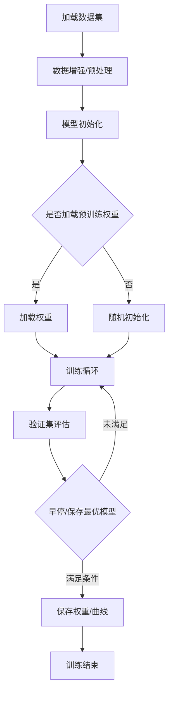
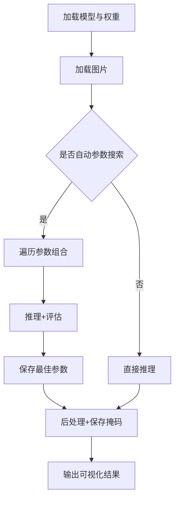
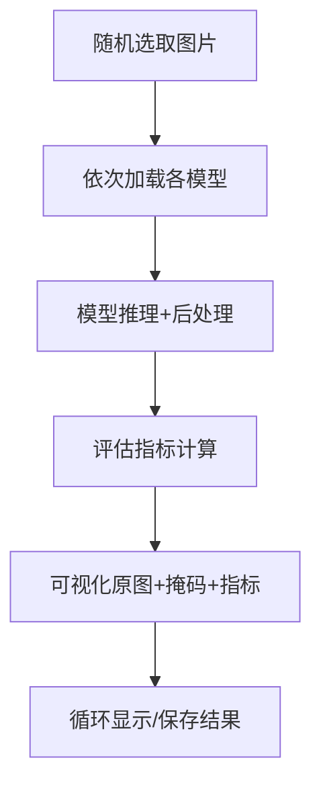
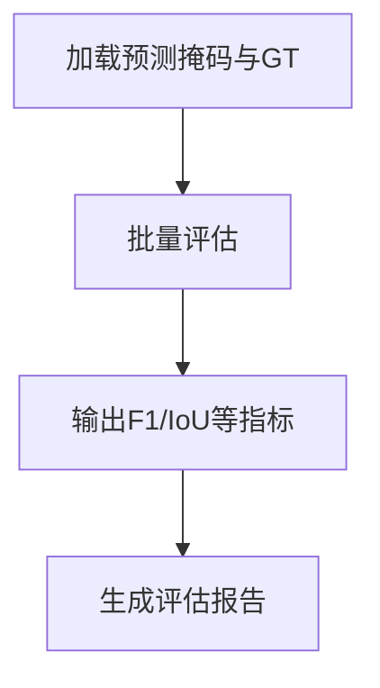

# Crack Segmentation 项目说明

本项目基于深度学习实现混凝土裂缝分割，支持多种主流模型，具备自动化训练、超参数优化、批量预测、自动评估、可视化等功能，适合科研与工程落地。

---

## 📁 目录结构与功能说明

| 文件/文件夹         | 主要功能与细节 |
|---------------------|-------------------------------------------------------------------|
| main_dev.py         | 训练主入口，支持超参数优化、早停、断点续训、自动保存最优模型、训练曲线可视化 |
| predict.py          | 批量预测与自动参数搜索，支持最佳参数保存/加载、后处理、结果可视化           |
| test.py             | 多模型对比测试，随机抽样、评估指标展示、掩码可视化                        |
| eval.py             | 批量评估，输出各类分割指标（F1、IoU等）                                   |
| model.py            | UNet、LMM_Net等模型结构定义                                               |
| efficientnet.py     | EfficientCrackNet模型结构实现                                            |
| mobileVitblock.py   | MobileViT相关模块实现                                                    |
| utils.py            | 数据集加载、数据增强、工具函数、权重初始化等                              |
| loss_functions.py   | BCE、Dice、IoU等损失函数实现                                             |
| eval_metrics.py     | 评估指标函数（F1、IoU等）                                                |
| data_preprocessing.py | 数据预处理脚本（如格式转换、切片等）                                   |
| sample_img_extraction.py | 样本图片提取脚本                                                    |
| check_weights.py    | 权重文件检查工具                                                        |
| DeepCrack/          | 数据集目录，含训练/验证/测试图片及掩码                                   |
| saved_models/       | 训练过程中自动保存的模型权重                                             |
| predictions/        | 预测结果输出目录                                                        |
| plots/              | 训练/验证曲线、流程图等可视化结果                                       |
| best_params/        | 自动参数搜索保存的最佳参数json                                           |
| .gitignore          | Git忽略配置，防止大文件/中间结果上传                                     |

---

## 🚀 主要功能流程

### 1. 训练流程（main_dev.py）

- 支持Optuna自动超参数优化，自动切换验证集/测试集。
- 训练过程自动保存最优模型和训练曲线。
- 支持断点续训、预训练权重加载。

### 2. 预测与参数搜索流程（predict.py）

- 自动搜索最佳后处理参数（阈值、最小面积、形态学核），并保存为json。
- 支持批量预测、单张预测，自动保存可视化结果。

### 3. 测试与多模型对比（test.py）

- 支持多模型同图对比，评估指标直观展示。

### 4. 评估与报告（eval.py）


---

## 🧩 细节亮点
- **数据增强**：支持旋转、翻转、缩放、裁剪、颜色扰动、噪声、模糊等，提升模型泛化。
- **自动参数搜索**：推理时自动遍历后处理参数，保存最优组合，提升分割精度。
- **早停机制**：多指标监控，自动调整学习率，防止过拟合。
- **可视化**：训练曲线、掩码对比、流程图一应俱全。
- **高可扩展性**：新增模型/损失/数据增强极为方便。
- **中文注释丰富**，便于团队协作和二次开发。

---

## 🛠️ 依赖环境
- Python 3.6+
- PyTorch 1.7+
- torchvision, numpy, opencv-python, scikit-learn, optuna, matplotlib, tqdm
- 推荐用 requirements.txt 管理依赖

---

## 📖 快速上手

### 训练
```bash
python main_dev.py --model_name UNet --data_dir "DeepCrack" --data_name "deepcrack" --run_num 1 --epochs 100 --validate True
```

### 超参数优化训练
```bash
python main_dev.py --model_name UNet --data_dir "DeepCrack" --data_name "deepcrack" --run_num 1 --epochs 100 --optimize True --validate True
```

### 预测（自动参数搜索）
```bash
python predict.py --model_name UNet --model_path "saved_models/UNet/best_model_num_1.pt" --input_dir "DeepCrack/test_img" --mask_dir "DeepCrack/test_lab" --auto_search --output_dir predictions/UNet
```

### 评估
```bash
python eval.py --model_name UNet --pred_dir predictions/UNet --gt_dir DeepCrack/test_lab
```

---

## 📝 许可证
MIT License

---

> 本项目适合科研、工程、课程设计等多场景，欢迎二次开发与贡献！
