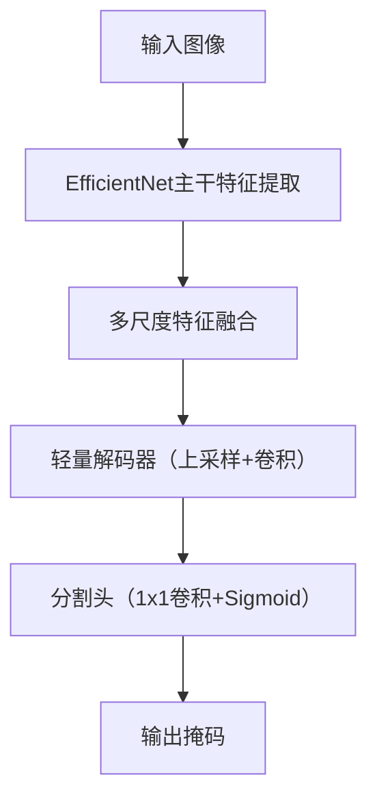
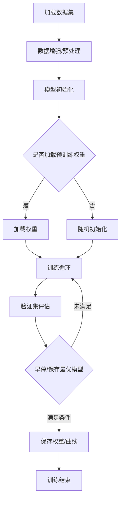
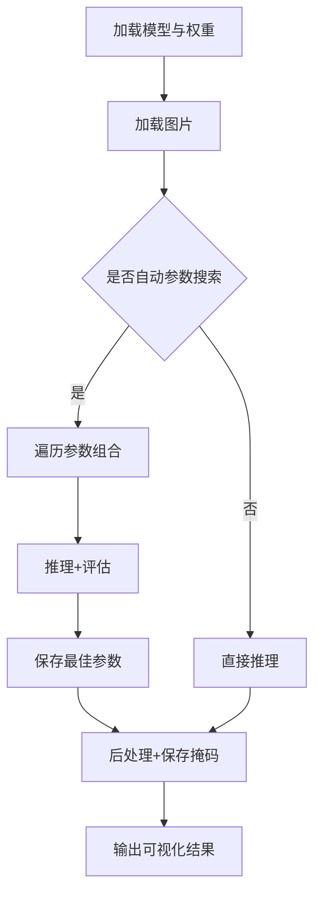
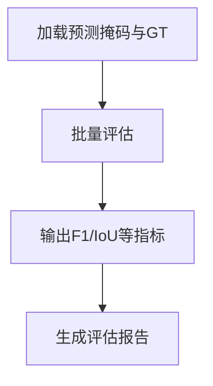
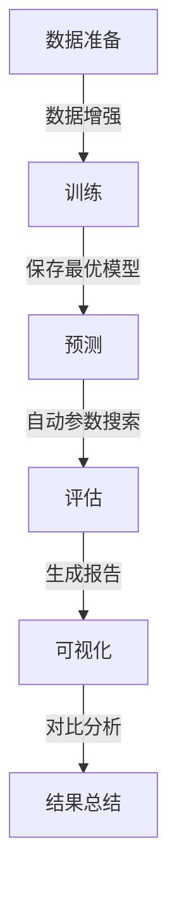
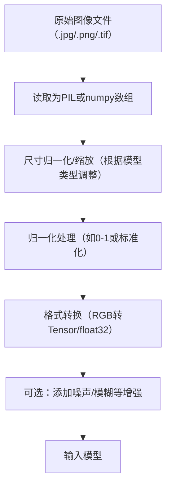
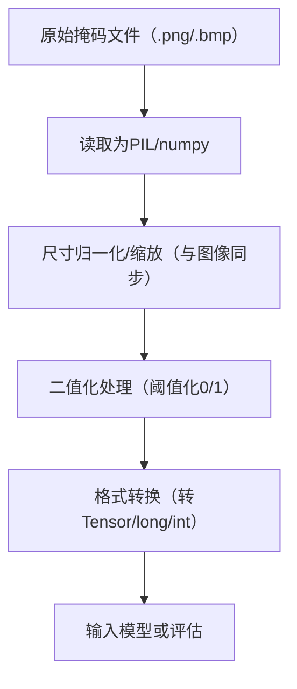
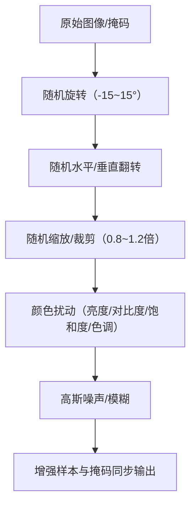

# Crack Segmentation 项目说明

本项目基于深度学习实现混凝土裂缝分割，支持多种主流模型，具备自动化训练、超参数优化、批量预测、自动评估、丰富可视化和详细结果分析，适合科研、工程、课程设计等多场景。

---

## 📁 目录结构与功能说明

| 文件/文件夹         | 主要功能与细节 |
|---------------------|-------------------------------------------------------------------|
| main_dev.py         | 训练主入口，支持超参数优化、早停、断点续训、自动保存最优模型、训练曲线可视化 |
| predict.py          | 批量预测与自动参数搜索，支持最佳参数保存/加载、后处理、结果可视化           |
| test.py             | 多模型对比测试，随机抽样、评估指标展示、掩码可视化                        |
| eval.py             | 批量评估，输出各类分割指标（F1、IoU等）                                   |
| model.py            | UNet、LMM_Net等模型结构定义                                               |
| efficientnet.py     | EfficientCrackNet模型结构实现                                            |
| mobileVitblock.py   | MobileViT相关模块实现                                                    |
| utils.py            | 数据集加载、数据增强、工具函数、权重初始化等                              |
| loss_functions.py   | BCE、Dice、IoU等损失函数实现                                             |
| eval_metrics.py     | 评估指标函数（F1、IoU等）                                                |
| data_preprocessing.py | 数据预处理脚本（如格式转换、切片等）                                   |
| sample_img_extraction.py | 样本图片提取脚本                                                    |
| check_weights.py    | 权重文件检查工具                                                        |
| DeepCrack/          | 数据集目录，含训练/验证/测试图片及掩码                                   |
| saved_models/       | 训练过程中自动保存的模型权重                                             |
| predictions/        | 预测结果输出目录                                                        |
| plots/              | 训练/验证曲线、流程图、结果可视化                                       |
| best_params/        | 自动参数搜索保存的最佳参数json                                           |
| .gitignore          | Git忽略配置，防止大文件/中间结果上传                                     |

---

## 🌟 EfficientCrackNet 模型架构详解

EfficientCrackNet 是本项目的高效裂缝分割主力模型，融合了 EfficientNet 的高效特征提取能力与轻量化解码结构，适合边缘设备和大规模工程应用。

### EfficientCrackNet 结构流程图

- **主干网络**：采用 EfficientNet（如B0/B1）提取多层特征，兼顾速度与精度。
- **多尺度融合**：融合不同层次的特征，提升对细小裂缝的感知。
- **轻量解码器**：采用上采样+卷积结构，逐步恢复空间分辨率。
- **分割头**：1x1卷积输出单通道概率图，Sigmoid激活得到像素级分割。

### EfficientCrackNet 主要优点
- 计算量小，推理速度快，适合大批量或边缘部署。
- 多尺度特征融合，提升对细微裂缝的检测能力。
- 结构简洁，易于扩展和迁移。

---

## 🚦 训练、预测、评估流程图与详细说明

### 1. 训练流程

- **加载数据集**：支持DeepCrack等多种格式，自动分train/val/test。
- **数据增强/预处理**：旋转、翻转、裁剪、噪声、归一化等。
- **模型初始化**：支持UNet、LMM_Net、EfficientCrackNet等。
- **预训练权重**：可选，提升收敛速度。
- **训练循环**：支持多损失联合、梯度累积、自动混合精度。
- **验证集评估**：每epoch评估F1/IoU等。
- **早停/保存最优模型**：防止过拟合，自动保存最优权重。
- **训练结束**：输出训练日志和曲线。

### 2. 预测流程

- **自动参数搜索**：遍历阈值、最小面积、形态学核，自动选最优。
- **批量预测**：支持文件夹输入，自动保存掩码和可视化。
- **后处理**：形态学操作、连通域筛选等。

### 3. 评估流程

- **批量评估**：支持多模型、全量图片。
- **输出指标**：F1、IoU、Precision、Recall等。
- **生成报告**：可导出表格、绘制对比图。

---

## 🧮 损失函数与评估指标

### 1. 二值交叉熵（BCE）
用于像素级二分类，衡量预测概率与真实标签的差异。

公式：

$$
\mathrm{BCE} = -\frac{1}{N} \sum_{i=1}^N \left[ y_i \log(p_i) + (1-y_i) \log(1-p_i) \right]
$$

> **Tips**：BCE适用于前景/背景极不平衡时，常与Dice/IoU联合使用。

### 2. Dice Loss（Dice系数损失）
衡量预测掩码与真实掩码的重叠程度，适合处理类别极不平衡的分割任务。

$$
\mathrm{Dice} = \frac{2 \sum_i p_i y_i}{\sum_i p_i + \sum_i y_i}
$$

Dice Loss $= 1 - \mathrm{Dice}$

> **Tips**：Dice对小目标敏感，常用于医学/裂缝等分割。

### 3. IoU Loss（交并比损失）
衡量预测与真实掩码的交集与并集比例。

$$
\mathrm{IoU} = \frac{\sum_i p_i y_i}{\sum_i p_i + \sum_i y_i - \sum_i p_i y_i}
$$

IoU Loss $= 1 - \mathrm{IoU}$

> **Tips**：IoU是竞赛和论文常用主指标，越高越好。

### 4. F1 Score（F1分数）
综合考虑精确率（Precision）和召回率（Recall），是分割常用的综合指标。

$$
\mathrm{F1} = \frac{2 \cdot \mathrm{Precision} \cdot \mathrm{Recall}}{\mathrm{Precision} + \mathrm{Recall}}
$$

其中：

$$
\mathrm{Precision} = \frac{TP}{TP + FP}
$$

$$
\mathrm{Recall} = \frac{TP}{TP + FN}
$$

> **Tips**：F1兼顾查全率和查准率，适合不均衡分割。

---

## 🚀 主要功能流程

### 1. 总体流程概览


### 2. 训练、预测、评估等详细流程见上文

---

## 📊 结果与评估

- **训练过程**：每轮训练/验证损失、F1、IoU等指标自动保存并绘图（见 plots/）。
- **预测结果**：每张图片的分割掩码自动保存（见 predictions/），支持原图与掩码对比可视化。
- **多模型对比**：test.py 支持同一图片多模型分割效果对比，指标一目了然。
- **评估报告**：eval.py 可批量输出所有图片的分割指标（F1、IoU、Precision、Recall），可导出为表格或可视化图。
- **参数最优性**：predict.py 自动搜索并保存最佳后处理参数，保证分割精度最大化。

---

## 🛠️ 依赖环境
- Python 3.6+
- PyTorch 1.7+
- torchvision, numpy, opencv-python, scikit-learn, optuna, matplotlib, tqdm
- 推荐用 requirements.txt 管理依赖

---

## 📖 快速上手

### 训练
```bash
python main_dev.py --model_name UNet --data_dir "DeepCrack" --data_name "deepcrack" --run_num 1 --epochs 100 --validate True
```

### 超参数优化训练
```bash
python main_dev.py --model_name UNet --data_dir "DeepCrack" --data_name "deepcrack" --run_num 1 --epochs 100 --optimize True --validate True
```

### 预测（自动参数搜索）
```bash
python predict.py --model_name UNet --model_path "saved_models/UNet/best_model_num_1.pt" --input_dir "DeepCrack/test_img" --mask_dir "DeepCrack/test_lab" --auto_search --output_dir predictions/UNet
```

### 评估
```bash
python eval.py --model_name UNet --pred_dir predictions/UNet --gt_dir DeepCrack/test_lab
```

### 多模型对比
```bash
python test.py
```

---

## 📝 许可证
MIT License

---

> 本项目适合科研、工程、课程设计等多场景，欢迎二次开发与贡献！

---

如需更详细的 API 文档、参数说明或自定义流程图，欢迎在 Issues 区留言或提交 PR！

---

## 📂 数据集结构与样例

建议结构如下：
```
DeepCrack/
  train_img/   # 训练图片
  train_lab/   # 训练掩码
  valid_img/   # 验证图片
  valid_lab/   # 验证掩码
  test_img/    # 测试图片
  test_lab/    # 测试掩码
```
- 图片和掩码文件名需一一对应。
- 支持多种格式（.png/.jpg/.bmp等）。

---

## 📈 结果可视化简明教程

- 训练/验证曲线自动保存在 `plots/` 目录。
- 预测掩码和原图对比图自动保存在 `predictions/` 目录。
- 支持 `test.py` 多模型对比可视化。
- 可用 `matplotlib`/`opencv`/`tensorboard` 进一步自定义可视化。

---

## 🛠️ 常见问题 FAQ & 调优建议

**Q1: 评估指标不高怎么办？**
- 检查数据增强是否合理，尝试更强/更弱增强。
- 调整损失函数权重（如alpha）。
- 尝试更深/更浅的模型。
- 检查后处理参数是否最优。

**Q2: 训练很慢/显存溢出？**
- 减小batch size或图片分辨率。
- 使用混合精度训练（AMP）。
- 关闭不必要的数据增强。

**Q3: 预测掩码全黑/全白？**
- 检查模型是否收敛。
- 检查阈值和后处理参数。

**Q4: 如何自定义新模型/损失/增强？**
- 在`model.py`/`loss_functions.py`/`utils.py`中新增类或函数，按现有接口注册即可。

---

## 🐞 模型输出调试与排查

为方便定位模型分割异常（如预测全黑/全白、概率分布异常等），本项目新增了调试脚本 `debug_model_output.py`，可用于详细分析各模型的输出概率分布、概率图、后处理效果及评估指标。

### 使用方法

```bash
python debug_model_output.py
```

- 随机选取一张测试图片，对UNet、LMM_Net、EfficientCrackNet分别推理。
- 输出每个模型的概率分布统计（min/max/mean/std）、不同阈值下的像素比例。
- 自动保存概率热力图、概率直方图、二值化结果到 `debug_outputs/` 目录。
- 打印后处理每一步的白色像素比例、连通域数量。
- 若有GT，自动计算F1、IoU、Precision、Recall等指标。

### 典型排查建议

- 若模型输出概率分布极窄（如全0.5左右），通常为权重未收敛、权重文件错误或推理归一化不一致。
- 若后处理后全黑/全白，建议先看概率分布和阈值设置，再排查权重和训练日志。
- 其他模型正常但某一模型异常，优先排查该模型权重和训练流程。

---

## 3.3 数据预处理流程

### 3.3.1 图像处理


**详细说明**：
- **读取**：支持多种格式，使用PIL或tifffile读取，保证通道顺序一致。
- **尺寸归一化/缩放**：根据模型（UNet:256x256, LMM_Net:112x224, EfficientCrackNet:192x256）自动调整图片尺寸。
- **归一化处理**：如`transforms.Normalize(mean, std)`，保证输入分布与训练一致。
- **格式转换**：PIL转Tensor，float32，通道顺序为[C,H,W]。
- **可选增强**：如高斯噪声、模糊（见数据增强部分），提升鲁棒性。

### 3.3.2 掩码处理


**详细说明**：
- **读取**：掩码与图像一一对应，支持多格式。
- **尺寸归一化/缩放**：与图像完全同步，保证像素对齐。
- **二值化处理**：所有非零像素归为1，背景为0，适配二分类分割。
- **格式转换**：转为Tensor，类型为long/int，便于损失函数计算。

### 3.3.3 数据增强


**详细说明**：
- **随机旋转**：图像与掩码同步旋转，提升方向鲁棒性。
- **随机翻转**：水平/垂直翻转，增加样本多样性。
- **缩放/裁剪**：随机缩放后裁剪或resize，防止模型过拟合特定尺寸。
- **颜色扰动**：对RGB图像进行亮度、对比度、饱和度、色调扰动，模拟不同光照。
- **高斯噪声/模糊**：模拟传感器噪声、模糊，提升模型抗干扰能力。
- **同步增强**：所有变换保证图像与掩码同步，避免标签错位。

> 具体实现详见`utils.py`的`DeepCrackDataset`和`CustomImageDataset`，以及`data_preprocessing.py`的增强函数。

---
